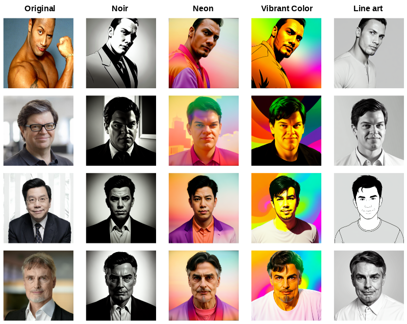
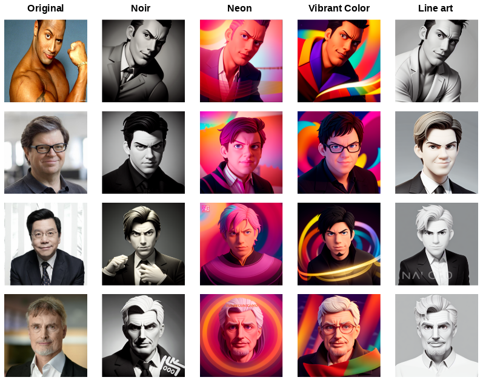
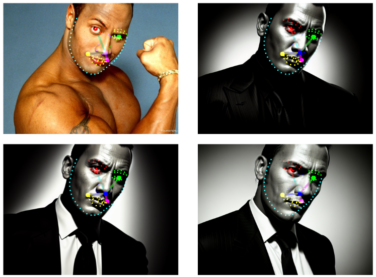
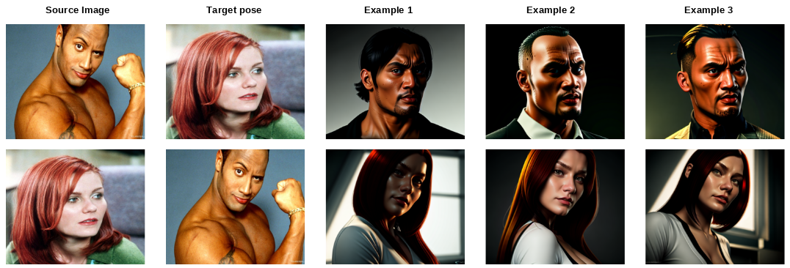
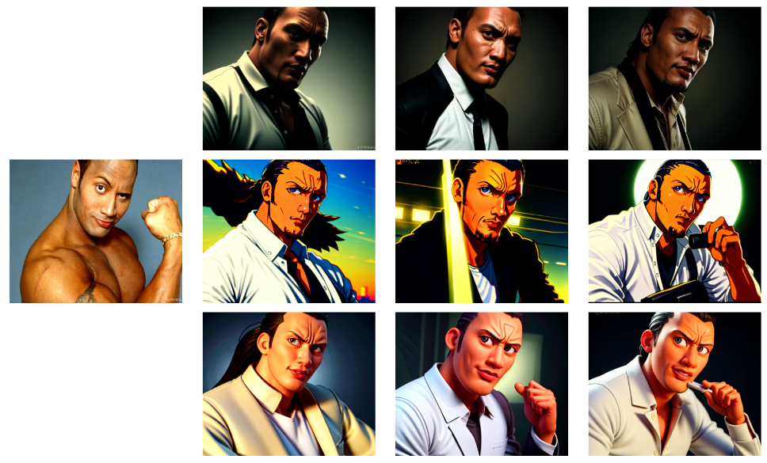
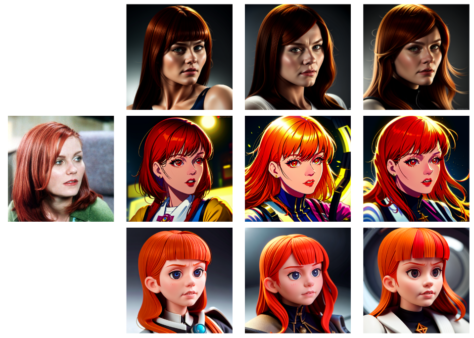
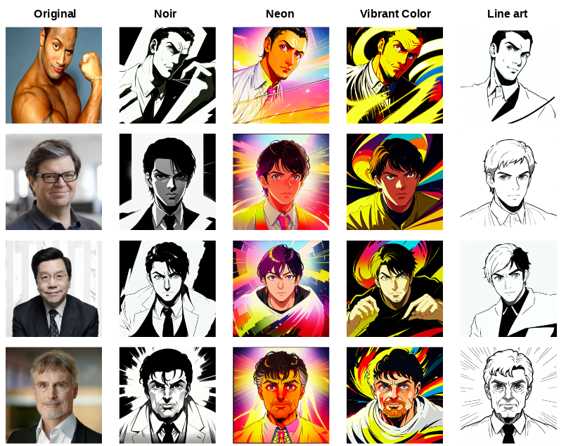

# InstantID for StableDiffusion 1.5
This is unofficial implementation InstantID for StableDiffusion 1.5.  
SD15 has a lot of finetuned models. So you can use all of this models with combination of instantid components to get awesome results.  

<a href="https://instantid.github.io">Official InstantID</a> works only with SDXL and contains code only for inference.  
But this repository contains Training and Inference code.  
Training process was used only 10M images from <a href="https://github.com/FacePerceiver/LAION-Face">LAION-FACE 50M</a> dataset (Original InstantID used 50M Laion-face + 10M custom images).  
Feel free to adapt it for your personal purposes. I will be glad if somebody find it usefull.

## Examples
Examples with <a href="https://civitai.com/models/132632/epicphotogasm">epiCPhotoGasm model</a> + styles from original InstantID.
<p>
    
</p>
Examples with <a href="https://civitai.com/models/65203/disney-pixar-cartoon-type-a">Disney Pixar Cartoon Type A model</a> + styles from original InstantID.
<p>
    
</p>

InstantID SD1.5 components are not compatible with InstantID SDXL. In this work model has been trained with additional facial keypoints information.  
Keypoints visualization:
<p>
    
</p>
It is also possible to transfer different keypoints from other images.
<p>
    
</p>

Links:
- <a href="https://github.com/TheDenk/InstantID-SD1.5">Code training/inference (gradio, jupyter notebooks, .py files)</a>
- <a href="https://huggingface.co/TheDenk/InstantID-SD1.5">Checkpoints (Controlnet, resampler, ip-adapter)</a>
- <a href="https://github.com/deepinsight/insightface/issues/1896#issuecomment-1023867304">Insightface models for keypoints (antilopev2 and others)</a>

## How to use:
Clone this repo and install requirements.
```bash
git clone https://github.com/TheDenk/InstantID-SD1.5.git

cd InstantID-SD1.5 
pip install -r requirements.txt
```
### Download models 

1. clone <a href="https://huggingface.co/runwayml/stable-diffusion-v1-5">StableDiffusion1.5 into</a> `models` dir: 
```
git clone https://huggingface.co/runwayml/stable-diffusion-v1-5 ./models/stable-diffusion-v1-5
```
2. clone Instantid-SD1.5 models from <a href="https://huggingface.co/TheDenk/InstantID-SD1.5">HuggingFace</a>.  
```
git clone https://huggingface.co/TheDenk/InstantID-SD1.5 ./models/instantid-components
```
3. download antelopev2 archive from <a href="https://github.com/deepinsight/insightface/issues/1896#issuecomment-1023867304">this post</a> move to the models directory and unzip.  

The folder tree should be like:
```
  .
  ├── models
  │   ├── stable-diffusion-v1-5/*
  │   ├── antelopev2/*.onnx
  │   ├── instantid-components/*.ckpt
  │   └── additional-unets/*.safetensors (optional)  
  ├── instantid
  ├── gradio
  ├── inference.py
  ├── inference.ipynb
  └── README.md
```
### Run inference.py example
#### SIMPLE RUN
```bash
CUDA_VISIBLE_DEVICES="0" python3 inference.py \
    --image_path=examples/faces/rock.jpg \
    --prompt="the professional high quality photo of the man, high quality, best quality, masterpeace" \
    --style="Film Noir" \
    --height=640 \
    --width=768 \
    --num_inference_steps=25 \
    --guidance_scale=8.0 \
    --num_images_per_prompt=4
```
#### SELECT MODELS 
```bash
CUDA_VISIBLE_DEVICES="0" python3 inference.py --pretrained_model_path=models/stable-diffusion-v1-5 \
    --adapter_ckpt_path=models/instantid-components/ip-state.ckpt \
    --image_proj_ckpt_path=models/instantid-components/image_proj.ckpt \
    --controlnet_ckpt_path=models/instantid-components/controlnet.ckpt \
    --additional_unet_path=models/additional-unets/epicphotogasm_lastUnicorn.safetensors \
    --image_path=examples/faces/rock.jpg \
    --prompt="the professional high quality photo of the man, best quality, masterpeace" \
    --style="Film Noir" \
    --height=640 \
    --width=768 \
    --num_inference_steps=25 \
    --guidance_scale=8.0 \
    --num_images_per_prompt=4
```

### Run gradio demo
#### SIMPLE RUN
```bash
CUDA_VISIBLE_DEVICES="0" python3 gradio/app.py 
```
#### SELECT MODELS 
```bash
CUDA_VISIBLE_DEVICES="0" python3 gradio/app.py --pretrained_model_path=models/stable-diffusion-v1-5 \
    --adapter_ckpt_path=models/instantid-components/ip-state.ckpt \
    --image_proj_ckpt_path=models/instantid-components/image_proj.ckpt \
    --controlnet_ckpt_path=models/instantid-components/controlnet.ckpt \
    --additional_unet_path=models/additional-unets/epicphotogasm_lastUnicorn.safetensors
```

Or use code in jupyter-notebook (inference.ipynb file).

## Training
All models have been trained 780K steps on 3 GPU A6000 with `batch_size=20`, `resolution=512`, `lr=1e-5` and using only 10M images from <a href="https://github.com/FacePerceiver/LAION-Face">LAION-FACE</a> dataset. 
### Steps for training:
#### 1 Dowloand data from <a href="https://github.com/FacePerceiver/LAION-Face">LAION-FACE</a> and prepare images using official instruction.
#### 2 Filter dataset with `train/process_laion_dataset.py` script. It is using multiprocessing to increase processing speed. Example:
```bash
CUDA_VISIBLE_DEVICES="0" python3 process_laion_dataset.py \
    --data_root={DATASET_ROOT} \
    --split_name=split_00000 \
    --n_jobs=4
```
Replace `{DATASET_ROOT}` with your own path to LAION-Face dataset. For example `../LAION-Face`.  
It creates four directories in your `{DATASET_ROOT}`: `extracted_images`, `extracted_keypoints`, `embeddings`, `csv`. 
- `extracted_images` contains filtered and resized *.jpg images.
- `extracted_keypoints` contains *.jpg images with facial landmarks.
- `embeddings` contains *.pt files with extracted facial embeddings, landmarks, boxes and some other information.
- `csv` contains *.csv files with filtered images paths and textual descriptions.

The folder tree should be like:
```
  .
  └──{DATASET_ROOT}
      ├── extracted_images/*.jpg
      ├── extracted_keypoints/*.jpg
      ├── embeddings/*.pt
      └── csv/*.csv 
```

This script also filter data and skip images which contains too small faces and small images.   
You can regulate it with `min_h`, `min_w`, `min_head_coef` parameters. Default `min_head_coef=0.3`, `min_h=512` and `min_w=512`.   

#### 3 Run train.py file
```bash
CUDA_VISIBLE_DEVICES="0" accelerate launch train.py \
 --dataset_root="{DATASET_ROOT}" \
 --pretrained_model_name_or_path="./models/stable-diffusion-v1-5" \
 --output_dir="./output/instant_training" \
 --resolution=512 \
 --learning_rate=1e-5 \
 --validation_prompt "the professional photo of a beautifull girl, high resolution, awesome detailed, 4k, 8k" "beautifull redhead girl, high resolution, awesome detailed, 4k, 8k" \
 --validation_negative_prompt "lowres, worst quality, low quality" "lowres, worst quality, low quality" \
 --validation_image "./examples/valid/valid_keypoints.png" \
 --valid_embeddings "./examples/valid/valid_embeddings.pt" \
 --train_batch_size=20 \
 --dataloader_num_workers=32 \
 --validation_steps=2500 \
 --num_validation_images=4 \
 --num_train_epochs=1 \
 --checkpointing_steps=5000 \
 --mixed_precision=bf16
```
The validation image was taken from the LAION-Face dataset (just random image with extracted data).

## More examples
Using only models without special style prompts.  
<p>
    
</p>
<p>
    
</p>
Examples with <a href="https://civitai.com/models/24387/aniflatmix-anime-flat-color-style-mix">Aniflatmix model</a> + styles from original InstantID.
<p>
    
</p>

## Acknowledgements
- [InstantID](https://github.com/InstantID/InstantID) and InstantX Team.
- [IP-Adapter](https://github.com/tencent-ailab/IP-Adapter) and [ControlNet](https://github.com/lllyasviel/ControlNet). 